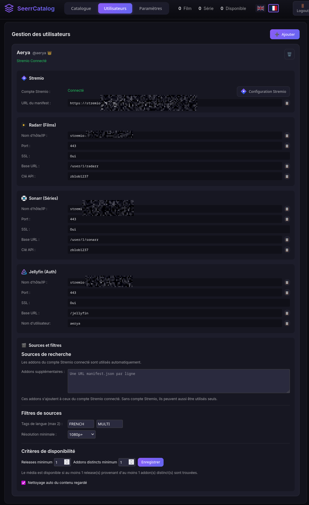
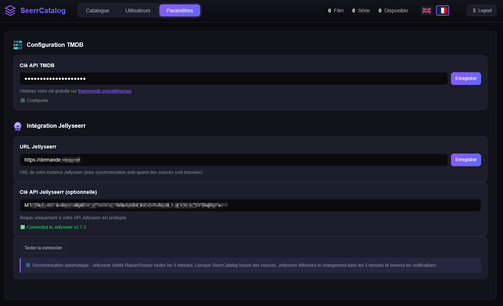
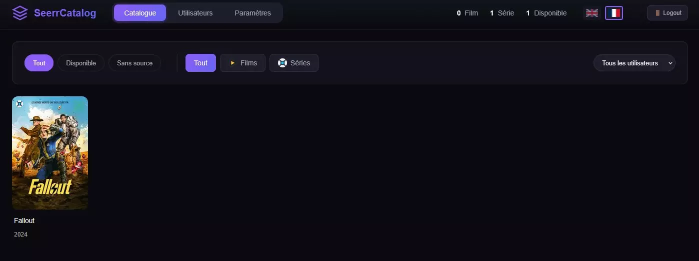
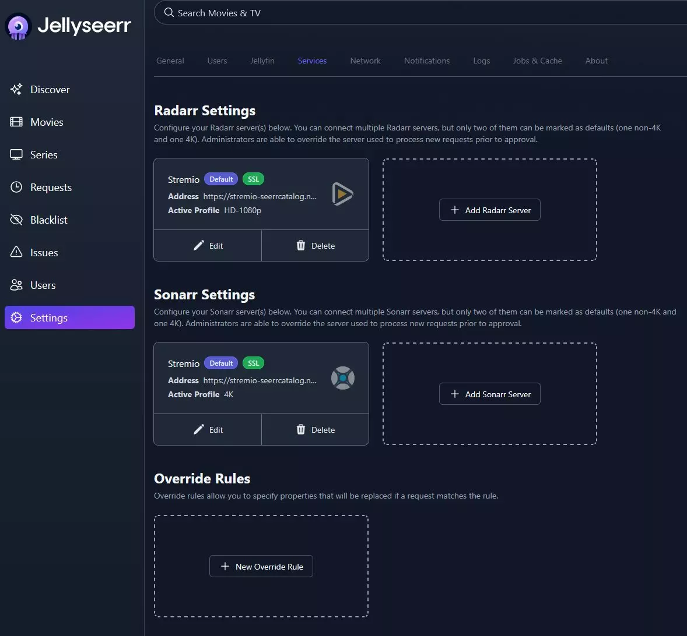
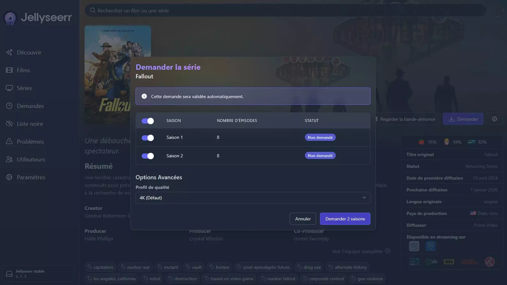
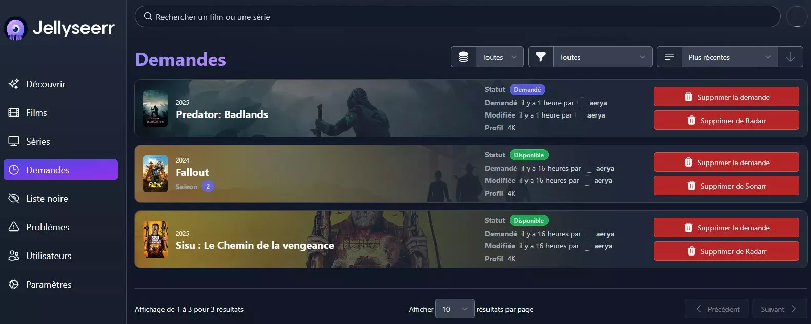
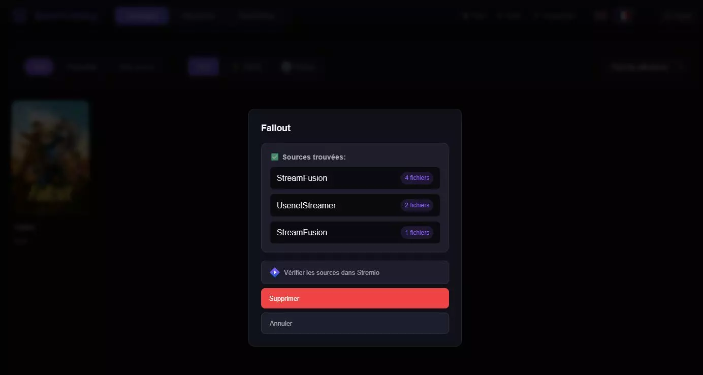
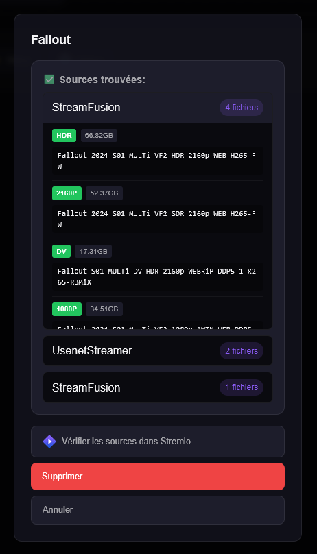
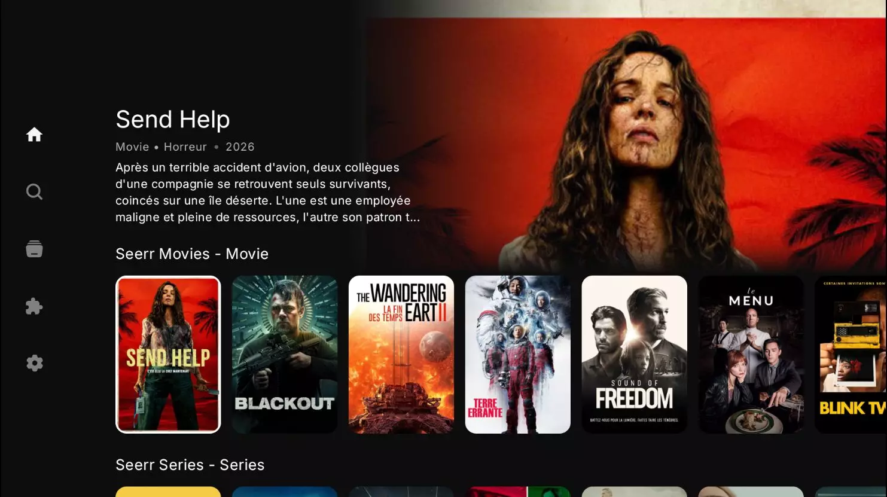

# SeerrCatalog

**A bridge between Jellyseerr and Stremio that turns media requests into a personal catalog, without SeerrCatalog downloading or storing media files.**

[Français](README.md)

[](https://github.com/Aerya/Stremio-Seerr-Catalog/actions/workflows/docker-publish.yml)
[](https://github.com/Aerya/Stremio-Seerr-Catalog/pkgs/container/stremio-seerr-catalog)
[](https://github.com/Aerya/Stremio-Seerr-Catalog/pkgs/container/stremio-seerr-catalog)
[](README.md)
[](LICENSE)

SeerrCatalog sits between Jellyseerr, Stremio and your streaming sources. It exposes Jellyseerr requests through Jellyfin / Radarr / Sonarr compatible APIs, builds a personal Stremio catalog and checks actual stream availability before marking media as available.

## How it works

```text
Jellyseerr
    |
    v
SeerrCatalog
    |
    +-- Personal Stremio catalog
    |
    +-- Release availability check
            |
            +-- Stremio account addons
            +-- Additional addons (manifest.json)
                    |
                    v
            Language / resolution filters
                    |
                    v
            Release threshold + distinct addon threshold
                    |
                    v
            Available / No source
```

Additional addons do not replace the addons from the connected Stremio account: **they are added to them**.

For example, if the Stremio account uses AIOStreams and Lumio, StreamFusion and StreamNZB are added manually, SeerrCatalog queries all of those sources.

Without a connected Stremio account, manually configured manifests can also be used on their own for availability checks. A Stremio account is still required for account-dependent features such as watched-state synchronization.

## Features

| Feature | Description |
|---|---|
| Stremio catalog | Jellyseerr requests become a personal catalog available in Stremio. |
| Jellyseerr compatibility | Emulates the Jellyfin, Radarr and Sonarr APIs used by Jellyseerr. |
| Stremio account addons | Addons exposing a `stream` resource are automatically loaded from the connected account. |
| Additional addons | Add compatible Stremio `manifest.json` URLs manually. |
| Addon compatibility | Works with addons such as AIOStreams, Lumio, StreamFusion, StreamNZB, LooStream and WaStream. |
| Filters | Filter releases by language tags and minimum resolution. |
| Configurable availability | Set the minimum release count and minimum distinct addon count per user. |
| Multi-user | Catalog, sources, filters and availability rules are isolated per user. |
| Automatic retry | Media without sources is checked again daily. |
| Watched synchronization | Content watched at 90% or more can be automatically removed from the catalog. |
| Discord notifications | Notify when no matching source is found. |
| WebUI | Responsive French and English interface. |

<!-- screenshots:start -->
## Screenshots

### SeerrCatalog WebUI

<p align="center">
  
</p>
<p align="center"><sub>
Complete per-user configuration: Stremio account, Radarr / Sonarr / Jellyfin endpoints, additional addons, filters and availability criteria.
</sub></p>

<table>
  <tr>
    <td width="50%" align="center"><strong>SeerrCatalog settings</strong></td>
    <td width="50%" align="center"><strong>Catalog</strong></td>
  </tr>
  <tr>
    <td></td>
    <td></td>
  </tr>
  <tr>
    <td align="center"><sub>TMDB configuration and Jellyseerr integration.</sub></td>
    <td align="center"><sub>Personal catalog with availability, media type and user filters.</sub></td>
  </tr>
</table>

### Jellyseerr integration

<table>
  <tr>
    <td width="50%" align="center"><strong>Radarr / Sonarr services</strong></td>
    <td width="50%" align="center"><strong>Creating a request</strong></td>
  </tr>
  <tr>
    <td></td>
    <td></td>
  </tr>
  <tr>
    <td align="center"><sub>Jellyseerr points to the Radarr and Sonarr endpoints emulated by SeerrCatalog.</sub></td>
    <td align="center"><sub>Requests are still created normally from Jellyseerr.</sub></td>
  </tr>
</table>

<p align="center">
  
</p>
<p align="center"><sub>
Requests automatically become available once SeerrCatalog validates the configured source criteria.
</sub></p>

### Source detection

<p align="center">
  
</p>
<p align="center"><sub>
Compact view of the addons that returned releases and the number of matching results.
</sub></p>

<p align="center">
  
</p>
<p align="center"><sub>
Detailed release information including addon, quality, size and release name.
</sub></p>

### Nuvio

<p align="center">
  
</p>
<p align="center"><sub>
Catalogs generated by SeerrCatalog can be consumed by Stremio-addon-compatible clients, shown here in Nuvio.
</sub></p>
<!-- screenshots:end -->

## Availability rules

Two independent values determine when media is considered available:

- **Min releases**: total number of releases matching the filters.
- **Min distinct addons**: number of different sources that must return at least one release.

| Min releases | Min addons | Example |
|---:|---:|---|
| 1 | 1 | At least one release from one source. |
| 2 | 1 | At least two releases, even from a single addon. |
| 1 | 2 | At least two different addons must return a release. |
| 3 | 2 | At least three releases in total from at least two addons. |

Both values default to `1`, preserving the previous behavior.

## Installation

```yaml
services:
  seerr-catalog:
    image: ghcr.io/aerya/stremio-seerr-catalog:latest
    container_name: seerr-catalog
    ports:
      - "7000:7000"
    environment:
      - BASE_URL=http://localhost:7000
      - API_KEY=
      - PORT=7000
      - HOST=0.0.0.0
      - TMDB_API_KEY=
    volumes:
      - /mnt/Docker/stremio/seerrcatalog:/app/data
    restart: always
```

Start:

```bash
docker compose up -d
```

## Configuration

1. Open `http://localhost:7000`.
2. Create the administrator account.
3. Configure the TMDB key.
4. Connect a Stremio account if you want to automatically use its addons and watched synchronization.
5. Under **Users > Sources & filters**, configure additional addons, filters and availability thresholds when needed.
6. Configure Jellyseerr with the Radarr / Sonarr information displayed by SeerrCatalog.
7. Install the SeerrCatalog manifest in Stremio.

### Search sources

For each user:

- addons from the connected Stremio account are loaded automatically;
- manifests entered under **Additional addons** are added to the same pool;
- the same Stremio transport is queried only once if it appears in both lists;
- filters are applied to returned releases;
- availability thresholds are evaluated against the combined result.

Manifest URLs are stored per user.

## Environment variables

| Variable | Description | Default |
|---|---|---|
| `PORT` | SeerrCatalog HTTP port | `7000` |
| `HOST` | Listening interface | `0.0.0.0` |
| `TMDB_API_KEY` | TMDB API key used for metadata | — |
| `BASE_URL` | Public URL, especially behind a reverse proxy | auto-detected |
| `API_KEY` | API key exposed to compatible clients | — |

## Updating

With Docker Compose:

```bash
docker compose pull
docker compose up -d --force-recreate
```

A plain `docker compose restart` is not enough after a `pull`: it restarts the existing container with the image it was created from.

With Dockge / Dockge-Enhanced, use **Pull & Recreate** to apply a newly downloaded image.

## Security

Some `manifest.json` URLs may contain private tokens, keys or configuration parameters.

- Do not publish these URLs.
- Protect the `/app/data` volume, which contains application settings.
- Use HTTPS when the instance is exposed through a reverse proxy.
- Set `BASE_URL` to the public URL when SeerrCatalog runs behind a proxy.

## Documentation

Article and screenshots: [UpAndClear — SeerrCatalog, the Over/Jelly/Seerr addon for Stremio](https://upandclear.org/2026/01/03/seerrcatalog-laddon-over-jelly-seerr-pour-stremio/)

Docker image: [ghcr.io/aerya/stremio-seerr-catalog](https://github.com/Aerya/Stremio-Seerr-Catalog/pkgs/container/stremio-seerr-catalog)

## Project

Developed and maintained by [Aerya](https://github.com/Aerya).

Website: [UpAndClear](https://upandclear.org/)

If SeerrCatalog is useful to you, you can support the project by starring the repository.

## License

MIT — see [LICENSE](LICENSE).
